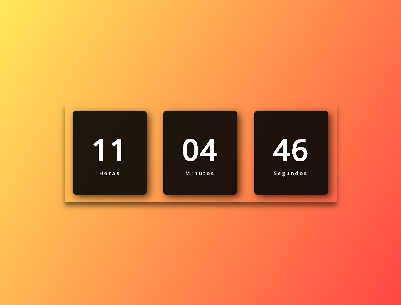
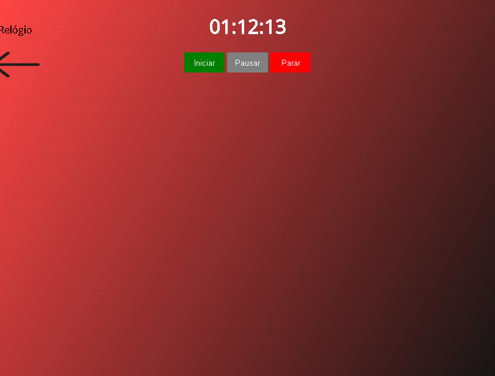

# Relógio em HTML,CSS e JavaScript
 
 >Projeto feito de acordo com os vídeos [Relógio Digital DINÂMICO | HTML, CSS e JS.](https://www.youtube.com/watch?v=GK0ok3ZCXwM) por Larissa Kich e [Criando um cronômetro com JavaScript](https://www.youtube.com/watch?v=msyTjg3t4Z8) por Leo Ujo!

 
 

 ## ⚙️Tecnologias

- HTML
- CSS
- JavaScript
- Git e Github

## 📮Contato
ryanvmlima01@gmail.com